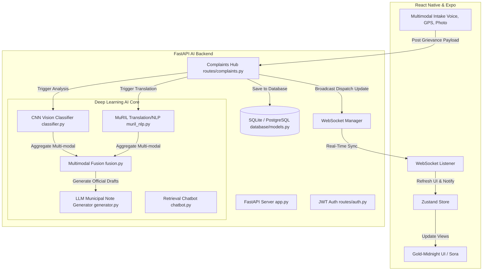

# CivicAI 🏛️✨
### *Autonomous Multi-Modal Grievance Routing & Smart City Dispatch Engine*

CivicAI is a premium, enterprise-grade mobile platform and AI-driven dispatcher that bridges the gap between citizens and municipal authorities. By fusing advanced computer vision, multilingual NLP, and real-time WebSockets, CivicAI automates intake, triggers AI routing to city departments, tracks live resolution status, and presents active analytics to both citizens and city admins.

Inspired by premium dark UI aesthetics from **Linear, Apple, and Tesla**, the application utilizes a gorgeous **"Gold-Midnight" design system**, dynamic **ambient orbs** driven by React Native Reanimated, **Sora typography**, and high-fidelity **glassmorphic surfaces** to deliver a $50M+ tech-startup experience out of the box.

---

## 🏛️ System Architecture

CivicAI is built as a highly decoupled, real-time ecosystem consisting of a premium **Expo Mobile Client** and a robust **FastAPI AI Backend**.



---

## 👥 User Roles: Citizen vs. Administrator

CivicAI operates on a robust role separation architecture to facilitate distinct access permissions for normal citizens and municipal administrators:

| Feature | 👤 Citizen (User) | 🏛️ Admin (Administrator / Officer) |
| :--- | :---: | :---: |
| **AI Grievance Ingestion** <br>*(Submit new reports with photos/text/voice)* | **Allowed** <br>*(Intakes with NLP + Multimodal Vision models)* | **Allowed** |
| **Interactive Hotspot Heatmap** | **View-Only** <br>*(Track civic issue clusters in the city)* | **View-Only** |
| **Personal Grievance Logs & History** | **Enabled** <br>*(View personal complaints & progress timelines)* | **Enabled** |
| **CivicAI Chatbot Assistant** | **Enabled** <br>*(Ask about department routing, FAQ)* | **Enabled** |
| **Municipal Dispatch Command Center** | 🚫 **Restricted** <br>*(Dynamic tile hidden on home dashboard)* | **Full Access** <br>*(Control Center at `/admin`)* |
| **Interactive Queue Management** | 🚫 **Restricted** | **Enabled** <br>*(Inspect incoming issues & assign officers)* |
| **Officer Assignment & Status Control** | 🚫 **Restricted** | **Enabled** <br>*(Manually transition status and set priority)* |
| **Department Workload Monitoring** | 🚫 **Restricted** | **Enabled** <br>*(Real-time performance & dispatch meters)* |

---

## 🌟 Core Features

### 1. 🔑 Integrated Dual-Role Authentication
- Seamless **Citizen** vs. **Admin Portal** login.
- Prefilled segmented test selector at the top of the authentication card container:
  - **Citizen User:** Tap to pre-fill `user@civicai.com` and log in to file grievances, look up statuses, and chat with the AI assistant.
  - **Admin Portal:** Tap to pre-fill `admin@civicai.com` and log in to inspect the municipal dispatch board, set priorities, and assign officers.
- Integrated tactile haptic mechanical click responses.

### 2. 🎙️ Multi-Modal Grievance Intake
- **Rich Media Intake:** Instantly snap photos or pick image assets to submit.
- **AI Soundwave Visualizer:** Elegant mic recording waveforms for spoken reports.
- **Multilingual Support:** Handles regional dialects (e.g., Telugu, Hindi) and parses intents.
- **GPS Auto-Clustering:** Autocompletes precise device geolocation coordinates.

### 3. 🧠 Multithreaded AI Core (Backend Pipeline)
- **Computer Vision Classifier:** Extracts the grievance category (e.g. Roads, Sanitation, Power, Water) and AI confidence intervals using pre-trained convolutional filters.
- **Google MuRIL Translator:** Real-time translation of colloquial and code-mixed scripts into structured English logs.
- **Multimodal Fusion Engine:** Matches vision classifier confidence maps against NLP intent signals to prevent spoofing and verify authentic claims.
- **LLM Municipal Drafter:** Automatically drafts formal, formatted intake briefs for municipal officers.

### 4. 🏛️ Municipal Command & Dispatch Center (Admin Exclusive)
- **Dispatch Board:** Live dashboard tracking active citizen complaints, AI routing, and workload loads.
- **Action Modal:** Assign field officers (e.g. "Officer Yaswanth"), configure priority levels (*low*, *medium*, *high*, *critical*), and update the tracking status.
- **Department Performance Indicators:** Clean workload status bars for civic departments (Sanitation, Power, Roads, Water).

### 5. 🗺️ Radar Heatmap & GPS HUD Scanner
- Dark geographic sector visualizer displaying complaint hotspots.
- Live priority-colored pulsing radar pings.
- Quick navigation filtering by category types.

### 6. 🤖 Context-Aware AI Chat Helper
- Dynamic chat assistant helping citizens easily retrieve complaint information, track ticket references, and get localized civic answers.

---

## 🛠️ Technology Stack

### Frontend Mobile App
- **Core Framework:** [Expo SDK 54 / Expo Router v3](https://expo.dev/) (Fully type-safe routes, native modules, custom asset pipelines)
- **Styling:** Vanilla StyleSheet with custom design system tokens.
- **State Management:** [Zustand](https://github.com/pmndrs/zustand) (Persistent client-side cache and WebSockets state sync)
- **Animations:** [React Native Reanimated](https://docs.swmansion.com/react-native-reanimated/) (Orb physics, breath cycles, custom slide transitions)
- **Haptics:** `expo-haptics`
- **Location:** `expo-location`

### Backend AI Engine
- **Framework:** FastAPI & Uvicorn (Asynchronous routing, real-time WebSocket connection manager)
- **Database:** SQLAlchemy (Unified models for Users, Complaints, Notifications, and Chat logs)
- **ML / AI Packages:** PyTorch, HuggingFace Transformers, Numpy

---

## 📂 Project Architecture

```
Civic-Mobile/
├── App.json               # Expo native application configuration
├── package.json           # Native package manager dependency locker
├── metro.config.js        # Optimized Metro bundler settings
├── src/
│   ├── app/               # Native File-System Navigation Stack (Expo Router)
│   │   ├── _layout.tsx    # Stack routing, global navigation settings & Launch controller
│   │   ├── index.tsx      # Main Home Dashboard (Metrics grid & operations quick access)
│   │   ├── login.tsx      # Dual-Role Apple-style Sign In screen (1-click Citizen vs Admin tabs)
│   │   ├── signup.tsx     # Citizen registration portal
│   │   ├── report.tsx     # Multimodal media intake (Voice soundwave, GPS tracking, Camera picker)
│   │   ├── processing.tsx # High fidelity status indicator simulation bars
│   │   ├── result.tsx     # AI Confidence display, categorized department assignment
│   │   ├── dashboard.tsx  # Aggregate analytics, department load meters
│   │   ├── history.tsx    # Citizen grievance log index with priority badges
│   │   ├── complaint-detail.tsx # Live status-timeline progress tracer
│   │   ├── notifications.tsx # Live push updates manager
│   │   ├── profile.tsx    # Personal stats dashboard
│   │   ├── settings.tsx   # Preference selectors and toggle controls
│   │   ├── admin.tsx      # Admin Dispatch Mission Control Console
│   │   ├── heatmap.tsx    # Localized coordinates mapping HUD
│   │   └── chat.tsx       # Conversational AI Assistant viewport
│   ├── components/        # Standardized Visual Core Components
│   │   ├── CityHologram.tsx # Futuristic rotating city map mesh
│   │   ├── GlassCard.tsx  # Apple-style glassmorphic panels
│   │   ├── LaunchScreen.tsx # Premium start screen glowing animation loader
│   │   └── PremiumButton.tsx # Golden call-to-action glow button triggers
│   ├── theme/             # Unified Design System tokens
│   │   ├── colors.ts      # Gold, Navy, and Surface Hex matrices
│   │   └── typography.ts  # Enforced Sora font configurations
│   └── store/
│       └── index.ts       # Centralized Zustand Store (Auth cache, Complaint feeds, Websockets sync)
└── backend/               # FastAPI AI Ecosystem
    ├── app.py             # Server initializer and WebSocket gateway
    ├── database/
    │   └── models.py      # SQLAlchemy Schema layouts
    ├── routes/
    │   ├── auth.py        # Token matching and roles router
    │   ├── complaints.py  # CRUD and automated AI intake triggers
    │   ├── analytics.py   # Geographic aggregates mapper
    │   └── whatsapp.py    # Mock twilio ingestion pathway
    └── ai/
        ├── classifier.py  # Convolutional vision category classification
        ├── muril_nlp.py   # Multi-lingual regional dialect processing
        ├── fusion.py      # Vision-NLP multimodal score corroborator
        ├── generator.py   # LLM mock drafter for city officials
        └── chatbot.py     # Conversational retrieval bot
```

---

## 🚀 Getting Started

### 1. Backend Server Setup
Navigate into the `backend` folder, create a python virtual environment, and launch the server:
```bash
cd backend
python -m venv venv
source venv/bin/activate   # On Windows: venv\Scripts\activate
pip install -r requirements.txt
python app.py
```
The FastAPI instance will launch at `http://localhost:8000`.

### 2. Mobile App Setup
In a new terminal window, navigate to the root directory, install npm modules, and run the packager:
```bash
cd Civic-Mobile
npm install --legacy-peer-deps
npx expo start -c
```
- Scan the Metro terminal QR code with your mobile device inside **Expo Go** to launch.
- Or press `w` to review the application inside your web browser.

---

## 🎨 Design Philosophy & Theme Matrix
The CivicAI layout adopts a sleek, visual command system designed to inspire authority, security, and high reliability:
* **Background Gradient:** Midnight Navy (`#05101E` to `#030C18`) providing ultimate screen depth.
* **Accents:** True premium gold (`#C9A84C`) active states representing standard high-class operations.
* **Aura Glow:** Radial floating orbs generated on GPU threads via `react-native-reanimated` shared values to construct a responsive, alive digital workspace.
* **Glassmorphism:** Card structures built using semi-transparent layers (`rgba(13,27,46,0.75)`) and micro border lines (`rgba(255,255,255,0.06)`) to maximize elegance.
